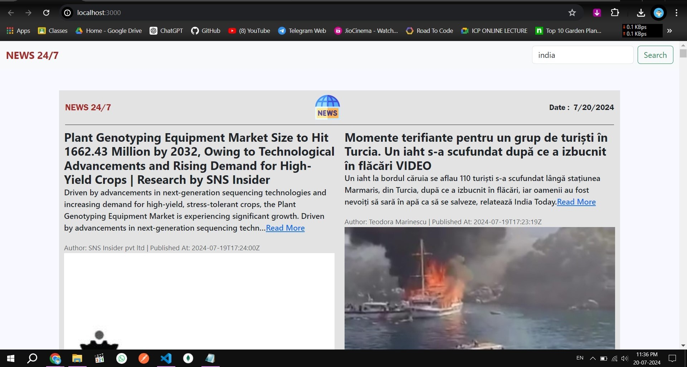

# News App

## Overview
This is a news app that allows users to search for news articles from different sources. The app uses
the News API to fetch news articles. The app is built using React. The app is designed to be responsive and work on both iOS and Android devices.

### Project View

### Running the Project on Localhost

To run this project on your local machine, follow these steps:

### Prerequisites

* Install [Node.js](https://nodejs.org/en/download/) (if you haven't already)
* Install a code editor or IDE of your choice (e.g., Visual Studio Code, Atom, Sublime Text)

### Steps to Run

1. **Clone the repository**: `git clone https://github.com/your-username/your-repo-name.git`
2. **Navigate to the project directory**: `cd your-repo-name`
3. **Install dependencies**: `npm install` or `yarn install`
4. **Start the development server**: `npm start` or `yarn start`
5. **Open in your browser**: [http://localhost:3000](http://localhost:3000)

### Tips and Tricks

* Make sure you have the latest version of Node.js installed.
* If you encounter any issues, try deleting the `node_modules` folder and running `npm install` or `yarn install` again.
* Use a code editor or IDE with syntax highlighting and debugging tools to make development easier.
* Don't forget to commit your changes regularly and push them to your remote repository.

**Acknowledgments:**

* Acknowledge any third-party libraries, frameworks, or resources used in the project, such as:
	+ Open-source libraries and frameworks
	+ APIs and services
	+ Inspiration and guidance from other projects and developers
  
Happy coding!